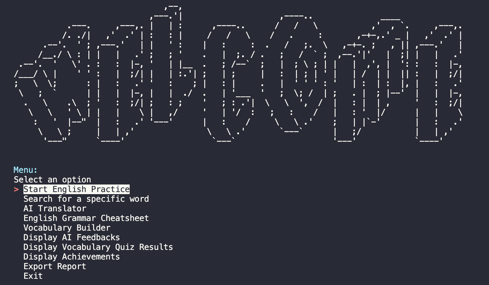
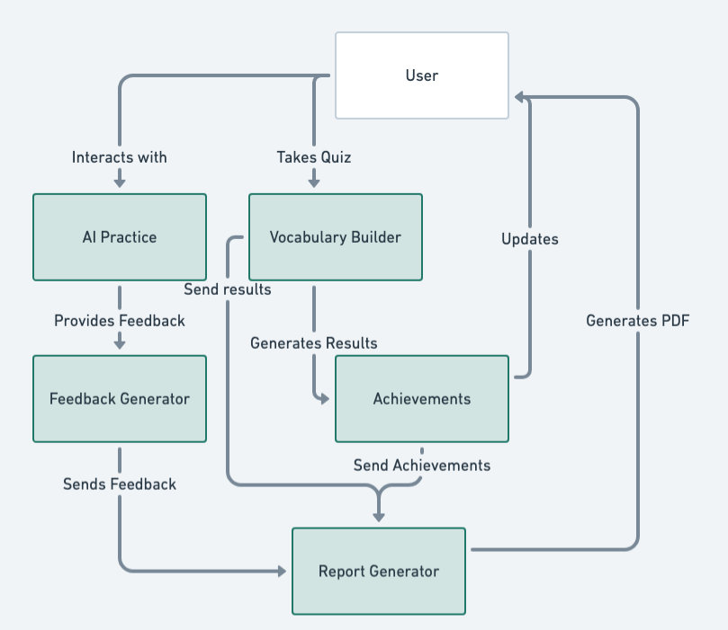

<h1 align="center">English Practice Simulator 🚀🌟</h1>

<p align="center">
  
</p>

Enhance your English proficiency with the English Practice Simulator! This interactive tool is designed to elevate your language skills through engaging activities. Join us on this linguistic journey!

## Table of Contents

- [Features](#features)
- [Installation](#installation)
- [Usage](#usage)
- [System Architecture](#system-architecture)
- [Contributing](#contributing)
- [Future Work](#future-work)

## Features

- **English Practice Sessions** 🤖: Engage in conversations with Lana, your AI tutor.
- **Dictionary Search** 📚: Instantly look up words to expand your vocabulary.
- **English Grammar Cheatsheet** 📝: Access a comprehensive collection of grammar tips.
- **Vocabulary Builder** 🧠: Boost your word power with interactive quizzes.
- **AI Feedback Display** 🤖💬: Monitor your progress with insightful AI feedback.
- **Vocabulary Quiz Results** 📊: Track your quiz performances to measure your knowledge.
- **Achievements System** 🏅: Earn badges as you reach language milestones.
- **Reporting System** 📃: Get a comprehensive report about what have you achieved!.
- **Interactive Navigation** 🔗: Navigate through the app using arrow keys.

### Advanced Components

- OpenAI Integration for natural language processing and text-to-speech
- Audio Recording and Playing for general practice
- Texting in and out for practice
- Google Authentication for secure access
- External Resources for additional learning materials

## Installation

1. Clone the repository:

   ```bash
   git clone https://github.com/AhmadAlhazmi75/UNIT-1-PROJECT
   cd UNIT-1-PROJECT
   ```

2. Set up a virtual environment and install dependencies:

   ```bash
   python -m venv .venv
   source .venv/bin/activate  # On Windows, use `.venv\Scripts\activate`
   pip install -r requirements.txt
   ```

3. Install system dependencies:

   ```bash
   brew install python portaudio ffmpeg cairo pango  # For macOS
   # For other OS, please refer to the documentation of each package
   ```

4. Configure API keys:
   - Set up your OpenAI API key (change .env.example to .env)
   - Configure Google OAuth credentials
   - Add `google_secrets.json` to the `db` folder

## Usage

1. Start the application:

   ```bash
   python main.py
   ```

2. Log in using Google Authentication

3. Choose a practice mode:
   - English Practice Sessions
   - Dictionary Search
   - Grammar Cheatsheet
   - Vocabulary Builder

<p align="center">
  
</p>

## System Architecture

<p align="center">
  
</p>

## Contributing

We welcome contributions to the English Practice Simulator! Here's how you can get involved:

### Reporting Issues

- Use the GitHub issue tracker to report bugs or suggest enhancements.
- Clearly describe the issue, including steps to reproduce for bugs.

### Submitting Pull Requests

1. Fork the repository and create your branch from `main`.
2. If you've added code, add tests that cover your changes.
3. Ensure your code follows the project's coding style.
4. Make sure all tests pass.
5. Issue your pull request!

## Future Work

- [x] Implement an achievements system for user motivation
- [x] Integrate OpenAI for natural language processing
- [x] Develop audio recording and playback functionality
- [x] Create a vocabulary builder with interactive quizzes
- [x] Export a report about the user's progress and achievements
- [ ] Develop a mobile app version for on-the-go learning
- [ ] Integrate more language learning APIs for diverse content
- [ ] Create a collaborative learning feature for peer-to-peer practice
- [ ] Design a progress tracking dashboard with detailed analytics
- [ ] Expand support for multiple languages beyond English

I'm always open to new ideas and contributions to make language learning more effective and enjoyable!
